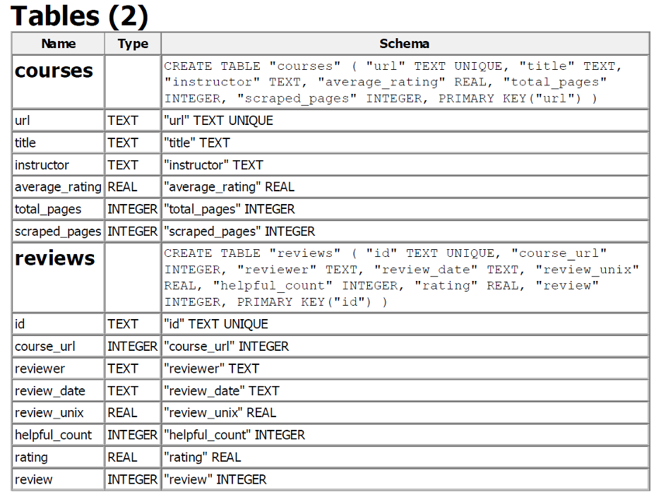

# Corpus Readme

[Link to the source of the corpus](https://www.coursera.org/)  
[Link to the collected corpus](https://github.ubc.ca/dinganc/COLX_523_team4/blob/master/src/d2.db)
- All information is stored in the database named `db_filtered.db`

## Information about the database
There are 2 tables: One for reviews and the other for courses. 
Here is Schema details about the tables: 

## Information about the documents
- Reviews
    - Total number of reviews in corpus are 19822
    - Average length of review is 271.718645948946
    - Most recent review date is Sep 9 ,2020
    - Oldest review date is April 1, 2016
    - Number of total tokens is 1002797
- Courses
    - Total number of courses scrapped are 90
    - Average number of pages in all courses are 48.64
    - Minimum number of pages for a course is 1 
    - Maximum number of pages for a course is 400
    - Overall pages in 90 courses are 4378, we are scrapping 10 pages only 

## Known problems with the corpus
- There is very little data about the workload and difficulty level.
- We had a lot of non-English courses and person names that needed to be cleaned up.  

