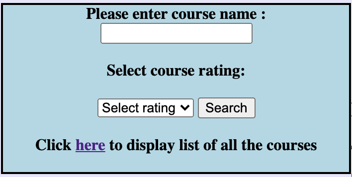
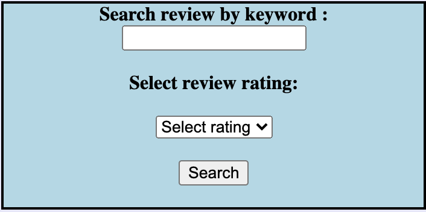

# Docker instruction

## Steps to run the docker image
1. Please download `team9_interface.tar` along with this instruction, and place in a directory that is easy to access.
2. Make sure Docker is running.
2. Navigate to the directory containing `team9_interface.tar` using terminal/command line.
3. Enter the following command to load the image: `docker load < team9_interface.tar`
4. Enter the following command to connect to local host, **the port number is 9999**: `docker run -p 9999:9999 team9_interface`
5. Open a browser and enter the following address: `http://localhost:9999/`

*Ta-Da! You now have access to our corpus*

## Corpus readme
**Homepage:** 
On homepage, you can find a brief explanation of why we chose to create this corpus, as well as some general stats about it.

**Search bar:** 
The search bar is always on the left hand side of the page.  
We provide you with 3 features, **please note that you can only perform 1 of the 3 options below at a time. E.g. showing the corpus statistics graphs while searching for annotation does not work.**
1. Full-corpus search 
2. Annotations
3. Corpus statistics graphs

 
1. **Full-corpus search**  
There are 3 ways to perform a keyword search on the entire corpus: by course name, by review keyword, by instructor. 
Please fill in one of the blue boxes below (when you start typing in one, the other fields will be automatically cleared to ensure an unambiguous search): 
  
  

This returns all course reviews satisfying the search condition.

2. **Annotations**  
To only see annotated reviews, use the `Select an annotation` box, and select a category from the drop down menu to see annotated reviews mentioned the chosen aspect. 

